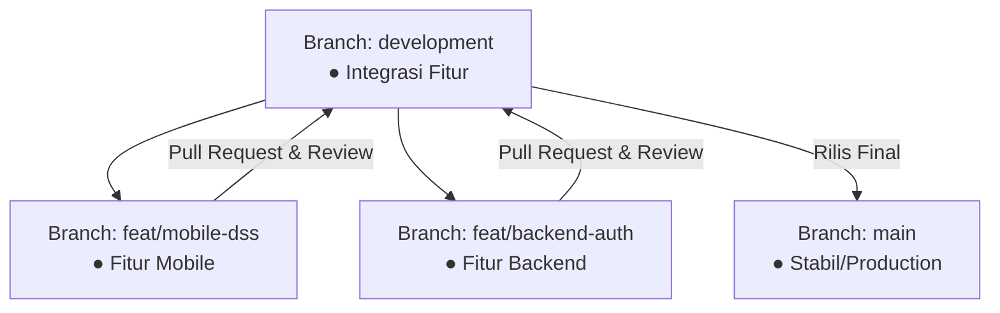

# 🚀 Panduan Kolaborasi Git & Monorepo (Mobile & Backend) - PostureFit

Panduan ini dibuat khusus untuk membantu tim pengembang **PostureFit** dalam menerapkan *Version Control* (Git) secara efektif dan profesional. Penerapan panduan ini akan memenuhi semua kriteria penilaian akademis terkait:
1. **Version Control yang Efektif**
2. **Commit yang Terstruktur**
3. **Penggunaan Branch secara Tepat**
4. **Kolaborasi Tim**
5. **Dokumentasi Proyek (README) yang Jelas**

---

## 📁 1. Struktur Folder: Monorepo (Single Repository)

Menggabungkan project **Mobile (Flutter)** dan **Backend** dalam satu repository (Monorepo) sangat direkomendasikan untuk proyek tim/capstone. Hal ini memudahkan sinkronisasi kode dan dokumentasi.

Ada **dua opsi** yang dapat dipilih untuk menyusun folder Anda:

### Opsi A: Monorepo Terpisah (Sangat Direkomendasikan & Profesional) 🌟
Semua kode mobile dipindahkan ke subfolder `/mobile` dan backend ke subfolder `/backend`. Struktur ini sangat bersih dan disukai dosen penguji.

```text
posturefit/
├── mobile/                 # Seluruh file Flutter dipindahkan ke sini
│   ├── lib/
│   ├── android/
│   ├── ios/
│   ├── pubspec.yaml
│   └── ...
├── backend/                # Folder baru untuk project backend teman Anda
│   ├── src/
│   ├── package.json (Node.js) atau requirements.txt (Python)
│   ├── .gitignore (spesifik backend)
│   └── ...
├── README.md               # README utama yang menjelaskan kedua project
├── .gitignore              # .gitignore global untuk monorepo
└── docs/                   # Folder dokumentasi (termasuk panduan ini)
```

> [!TIP]
> **Cara memindahkan file Flutter agar tidak kehilangan history Git:**
> Jangan lakukan *copy-paste* biasa! Gunakan perintah `git mv` di terminal agar Git tetap melacak history commit lama Anda:
> ```bash
> mkdir mobile
> git mv lib mobile/
> git mv android mobile/
> git mv ios mobile/
> git mv pubspec.yaml mobile/
> # Ulangi untuk folder/file Flutter lainnya, lalu lakukan commit.
> ```

### Opsi B: Monorepo Sederhana (Cepat & Tanpa Pindah Folder Flutter)
Jika Anda khawatir memindahkan folder Flutter akan merusak konfigurasi path IDE saat ini, Anda cukup membuat folder `backend` di dalam root project yang sekarang:

```text
posturefit/                 # Root tetap berupa project Flutter
├── lib/
├── android/
├── ios/
├── pubspec.yaml
├── ...
├── backend/                # Folder khusus untuk project backend
│   ├── src/
│   ├── package.json
│   └── ...
└── README.md               # README utama (diupdate dengan panduan backend)
```

---

## 🌿 2. Strategi Branching (Penggunaan Cabang Git)

Untuk berkolaborasi dengan aman tanpa merusak kode satu sama lain, gunakan alur **Git Flow Sederhana**. **Aturan Utama:** Jangan pernah melakukan push langsung ke branch `main`.



### Penjelasan Peran Branch:
1. **`main` / `master`**: Branch utama yang hanya berisi kode stabil dan siap dideploy. Dosen akan menguji aplikasi Anda dari branch ini.
2. **`development`** (atau `dev`): Branch integrasi. Semua fitur baru (dari mobile maupun backend) digabungkan di sini terlebih dahulu untuk diuji bersama.
3. **Branch Fitur (`feat/...`)**: Branch sementara untuk membuat fitur spesifik.
   * *Contoh*: `feat/mobile-dss-analysis`, `feat/backend-user-db`.
4. **Branch Perbaikan Bug (`fix/...`)**: Branch untuk memperbaiki masalah yang ditemukan di `development`.
   * *Contoh*: `fix/mobile-navbar-overflow`, `fix/backend-cors-issue`.

### 🛠️ Alur Kerja Praktis Kolaborasi:

#### Step 1: Tarik update terbaru dari remote repository
```bash
git checkout development
git pull origin development
```

#### Step 2: Buat branch baru untuk tugas Anda
```bash
# Contoh: Teman Anda ingin membuat API untuk Workout Log
git checkout -b feat/backend-workout-api
```

#### Step 3: Kerjakan kode, kemudian lakukan commit terstruktur
*(Gunakan panduan commit di bagian berikutnya).*

#### Step 4: Push branch fitur ke GitHub
```bash
git push origin feat/backend-workout-api
```

#### Step 5: Buka Pull Request (PR) & Lakukan Review
1. Buka halaman GitHub repository Anda.
2. Buat **Pull Request (PR)** dari `feat/backend-workout-api` menuju branch `development`.
3. Anda (sebagai rekan tim) wajib meninjau (*Code Review*) kode teman Anda di GitHub, pastikan tidak ada konflik, lalu klik **Merge Pull Request**.

---

## 📝 3. Commit yang Terstruktur (Conventional Commits)

Format commit terstruktur membantu dosen penilai memahami kontribusi masing-masing anggota tim dengan jelas. Gunakan format **Conventional Commits**:

```text
<type>(<scope>): <subject>
```

### Jenis Type yang Sering Digunakan:
* `feat`: Fitur baru untuk pengguna (mobile maupun backend).
* `fix`: Perbaikan bug atau error.
* `docs`: Perubahan atau penambahan dokumentasi (README, wiki, panduan).
* `style`: Perubahan visual, formatting, atau styling tanpa mengubah logika kode.
* `refactor`: Restrukturisasi kode agar lebih bersih tanpa mengubah fungsi aplikasi.
* `chore`: Pembaruan konfigurasi, dependencies, atau file pendukung (seperti `.gitignore`).

### 💡 Contoh Penerapan yang Bagus:
* `feat(backend): implement mongodb atlas connection for scraping data`
* `feat(mobile): add dss health status analysis page with GetX`
* `fix(mobile): resolve bottom navigation bar black rendering issue`
* `docs: update readme with backend installation steps`
* `refactor(mobile): modularize education card widget`
* `chore: update shared_preferences version in pubspec.yaml`

---

## 📖 4. Dokumentasi Proyek (README.md) yang Jelas

Dokumentasi README adalah **wajah pertama** dari proyek Anda yang akan dinilai oleh dosen. Berikut adalah kerangka README.md yang direkomendasikan untuk Monorepo Anda:

```markdown
# PostureFit - Integrated AI Health & Posture Tracker 🏃‍♂️

Aplikasi pemantauan postur tubuh berbasis kecerdasan buatan (AI) yang terintegrasi dengan Rencana Latihan (Workout Planning).

---

## 🏗️ Arsitektur Proyek (Monorepo)
- **/mobile**: Aplikasi Client berbasis **Flutter (Dart)** dengan state management **GetX**.
- **/backend**: Server API berbasis **[Node.js / Python Fast API / Express]** terhubung ke database **MongoDB Atlas**.

---

## 🛠️ Teknologi & Prerequisites
### Mobile Client
- Flutter SDK >= 3.0.0
- GetX, Shared Preferences, Google Fonts

### Backend API
- Node.js >= 18.x (atau Python >= 3.10)
- Database: MongoDB Atlas cloud database

---

## 🚀 Setup & Cara Menjalankan Aplikasi

### 1. Clone Repository & Masuk ke Folder
```bash
git clone https://github.com/RIQORAHMAHIDAYAT/PostureFit.git
cd Posturefit
```

### 2. Menjalankan Backend API
```bash
cd backend
npm install   # atau pip install -r requirements.txt
npm run dev   # atau python main.py
```

### 3. Menjalankan Mobile App (Flutter)
```bash
cd mobile     # atau tetap di root jika menggunakan Opsi B
flutter pub get
flutter run
```

---

## 🤝 Alur Kerja Kontribusi Tim (Git Workflow)
Kami menggunakan alur **Git Flow** dan **Conventional Commits**:
- `feat(mobile/backend): ...` untuk fitur baru.
- `fix(mobile/backend): ...` untuk perbaikan bug.
- Penggabungan kode wajib melalui **Pull Request (PR)** ke branch `development` sebelum digabungkan ke `main`.
```

---

## 💡 Ringkasan Rekomendasi Langkah Selanjutnya:
1. **Diskusikan dengan Tim**: Tentukan apakah ingin menggunakan **Opsi A** (memindahkan Flutter ke folder `/mobile`) atau **Opsi B** (langsung buat folder `/backend` di root).
2. **Buat Branch `development`**: Jika belum ada, buat branch `development` di GitHub sebagai tempat penggabungan fitur sehari-hari.
3. **Mulai Latihan Commit Terstruktur**: Biasakan menulis pesan commit dengan format `<type>(<scope>): <message>` agar riwayat Git terlihat profesional dan rapi!

---
*Dibuat untuk mempermudah kolaborasi tim PostureFit 2026.*
